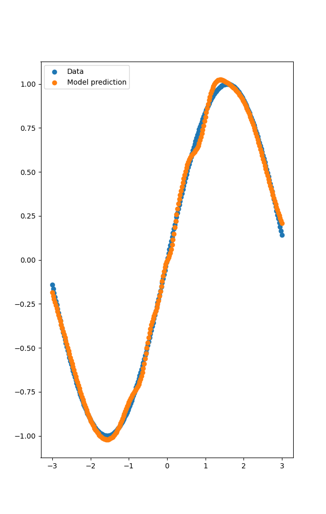

# AI-lib

AIlib  is a minimal deep learning library capable of handling reverse mode automatic 
differentiation. Despite its small size, it can be used to train more complicated Neural 
Networks such as CNNs ```examples/LeNet.py``` and transformers ```examples/transformer.py``` 

## Usage
```
git clone git@github.com:JussiKarkkainen/AI-lib.git
cd AI-lib
pip3 install -e .
```

## Example
The high level NN library is modeled after [dm/haiku](https://github.com/deepmind/dm-haiku)
where Neural Networks are defined in an object oriented manner, but are then transformed to 
pure functions with ```transform()```, so that the gradients of those functions can be evaluated.
Below is an implementation of a simple Multilayered Perceptron trained on a toy dataset.
See ```examples/``` for more

```python
import numpy as np
from AIlib.tensor import Tensor
from AIlib.autograd import grad
import AIlib.nn as nn
from AIlib.transform import transform
import matplotlib.pyplot as plt
from AIlib.nn.module import wrap_method

Xs = np.linspace(-3., 3., num=256)[:, None]
X = Tensor(Xs)
y = Tensor(np.sin(Xs))
xy = np.sin(Xs)

class Net(nn.Module):
    def __init__(self):
        super().__init__()
        self.l1 = nn.Linear(256)
        self.l2 = nn.Linear(256)
        self.l3 = nn.Linear(1)
    
    @wrap_method
    def __call__(self, x):
        out = self.l1(x).sigmoid()
        out = self.l2(out).sigmoid()
        out = self.l3(out)
        return out

def net_fn(x):
    net = Net()
    return net(x)

def main():
    network = transform(net_fn)
    optimizer = optim.sgd(0.003)
    
    def loss(params, X, y):
        out = network.apply(params, X)
        loss = Tensor.mean((out - y) ** 2)
        return loss

    def update(params, X, y):
        grads = grad(loss)(params, X, y)
        params, opt_state = optimizer.update(grads, state.opt_state)
        return nn.TrainingState(params, opt_state)

    init_params = network.init(X)
    init_opt_state = optimizer.init(init_params)
    state = nn.TrainingState(params=init_params, opt_state=init_opt_state)
    
    for epoch in range(1000):
        state = update(state.params, X, y)
```
Output of the trained model:
<br>

<br><br>

## Implementations details
The Tensor class defined in ```AIlib/tensor.py``` defines methods for creating tensors 
(arange(), randn(), normal(), etc) as well as activation functions and other math operations.
These operations use the same set of primitive ops defined in ```AIlib/ops.py```. During forward 
evaluation, a graph of all primitive ops used is created and used for gradient calculations.
The code for backpropagation is in ```AIlib/autograd.py``` 

Calculating gradients for a simple function:
```python
from AIlib.tensor import Tensor
from AIlib.autograd import grad
import torch

# ---- AIlib ----
a = Tensor([1, -3, 7])
b = Tensor([5, 4, 3])

def f(x, y):
    return a.mul(b).sum().log()   # grad() only accepts scalar output functions

# grad() returns the gradients, as well as the forward output
grads, value = grad(f, argnums=(0, 1))(a, b) 
print(grads)
# Outputs: [<Tensor [0.35714287 0.2857143  0.21428573] with shape: (3,)>, <Tensor [ 0.07142857 -0.21428573  0.5] with shape: (3,)>]

# ---- PyTorch ----
c = torch.tensor([1., -3., 7.], requires_grad=True)
d = torch.tensor([5., 4., 3.], requires_grad=True)

out = c.mul(d).sum().log()
out.backward()
print(c.grad, d.grad)
# Outputs: tensor([0.3571, 0.2857, 0.2143]) tensor([ 0.0714, -0.2143,  0.5000])
```

## Note:
AIlib still struggles with some numerical instability when training larger networks.
