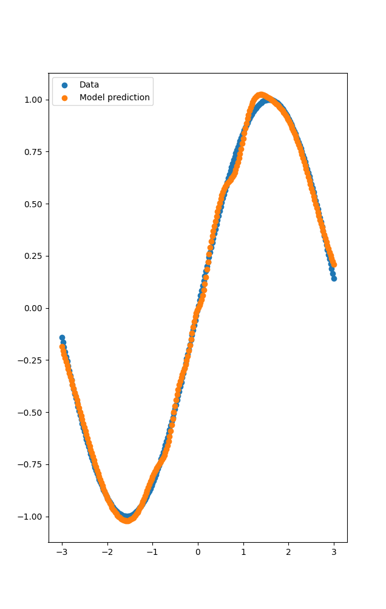

# AIlib

AIlib  is a minimal deep learning library capable of handling reverse mode automatic 
differentiation. Despite its small size, it can be used to train more complicated Neural 
Networks such as CNNs.


## Usage
```
git clone git@github.com:JussiKarkkainen/AI-lib.git
cd AIlib
python3 setup.py develop
```

## Example
The high level NN library is modeled after [dm/haiku](https://github.com/deepmind/dm-haiku)
where Neural Networks are defined in an object oriented manner, but are then transformed to 
pure functions with ```transform()```
Below is an implementation of a simple Multilayered Perceptron trained on a toy dataset.
See ```examples/``` for more
```
## Imports omitted -> see examples/simple_mlp.py for full code ##

Xs = np.linspace(-3., 3., num=256)[:, None]
X = Tensor(Xs)
y = Tensor(np.sin(Xs))
xy = np.sin(Xs)

class Net(nn.Module):
    def __init__(self):
        super().__init__()
        self.l1 = nn.Linear(256)
        self.l2 = nn.Linear(256)
        self.l3 = nn.Linear(1)
    
    @wrap_method
    def __call__(self, x):
        out = self.l1(x).sigmoid()
        out = self.l2(out).sigmoid()
        out = self.l3(out)
        return out

def net_fn(x):
    net = Net()
    return net(x)

def main():
    network = transform(net_fn)
    optimizer = optim.sgd(0.003)
    
    def loss(params, X, y):
        out = network.apply(params, X)
        loss = Tensor.mean((out - y) ** 2)
        return loss

    def update(params, X, y):
        grads = grad(loss)(params, X, y)
        params, opt_state = optimizer.update(grads, state.opt_state)
        return nn.TrainingState(params, opt_state)

    init_params = network.init(X)
    init_opt_state = optimizer.init(init_params)
    state = nn.TrainingState(params=init_params, opt_state=init_opt_state)
    
    for epoch in range(1000):
        state = update(state.params, X, y)
```
Output of the trained model:
<br><br>

<br><br>

## Note:
AIlib still struggles with some numerical instability when training larger networks

